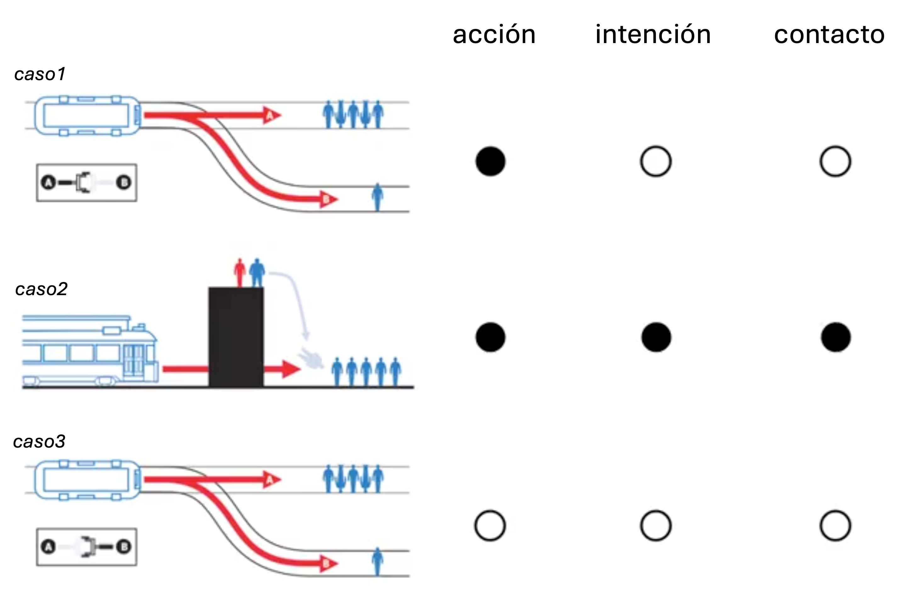

```{r message=FALSE, results="hide"}
library(rstan)
library(ggplot2)
library(gridExtra)
library(tidyverse)
library(cmdstanr)
library(rsample)
library(DiagrammeR)
library(kableExtra)
library(rethinking)
library(bayesplot)
library(ggdag)
library(dagitty)
library(posterior)
library(dplyr)
#library(loo)


```

## Introducción

El problema del tranvía ( _Trolley Problem_ ) es un experimento mental en ética que enfrenta a una persona con decisiones morales en situaciones de vida o muerte. Es ampliamente utilizado en filosofía moral y psicología para estudiar juicios morales.

La situación base consiste en lo siguiente ( _caso1_ ):

<p align="center">
_De pie junto a las vías del tren, Evan ve un vagón vacío y fuera de control que está a punto de atropellar a cinco personas. Junto a Evan hay una palanca que puede accionar, lo cual desviará el vagón hacia una vía alterna donde solo atropellaría a una persona. Lo anterior, evitará que atropelle a las cinco personas. Si Evan acciona la palanca, una persona será atropellada por el vagón, evitando que atropelle a las otras cinco personas. Si Evan no acciona la palanca, el vagón seguirá por las vías y atropellará a las cinco personas, y la persona en la vía alterna permanecerá a salvo._
</p>

::: {.center}
{ width=60% }
:::


<!-- <p align="center"> -->
<!--    -->
<!-- </p> -->

Una variante de este problema sería la siguiente ( _caso2_ ):

<p align="center">
_De pie junto a las vías del tren, Evan ve un vagón vacío y fuera de control que está a punto de atropellar a cinco personas. Junto a Evan hay una persona robusta a la cual podría empujar hacia las vías. El vagón se desaceleraría debido al impacto con esa persona, lo que evitaría que atropelle a las cinco personas. Si Evan empuja a la persona, esta caerá y será atropellada por el vagón, y así este se desacelerará y no atropellará a las otras cinco personas. Si Evan no empuja a la persona, el vagón seguirá por las vías y atropellará a las cinco personas, y la persona en la pasarela junto a él permanecerá a salvo por encima de la vía principal._
</p>

::: {.center}

:::

<!-- <p align="center"> -->
<!--    -->
<!-- </p> -->


Para estudiar las decisiones de los individuos ante variaciones del dilema utilizamos una base de datos llamada _trolley_, que contiene respuestas ordinales sobre la aceptabilidad moral de ciertas acciones. Las respuestas estan codificadas en una escala tipo Likert, por ejemplo: 1 (totalmente inaceptable) a 7 (totalmente aceptable).

El objetivo del proyecto es hacer un análisis técnico del problema con el propósito de hacer estimaciones causales sobre las respuestas de las personas.

Métodos: [*FALTA*]

Para nuestro proyecto haremos uso de distintos tipos de modelos:

1.  De manera inicial, generaremos un modelo lineal generalizado...
2.  Compararemos el modelo anterior con un modelo con priors informativas.
3.  Modelo con parámetros homogéneos: 
4.  Modelo con parámetros heterogéneos: 
5.  Modelo jerárquico: 
6.  Modelo jerárquico con DAG: 

## Datos

Como mencionamos previamente, para este proyecto usaremos la base de datos _“Trolley Problem”_ cargada en la librería _"rethinking"_ de R. En esta, hay 12 columnas y 9930 filas, que comprenden datos de 331 individuos únicos. El resultado que nos interesará es _response_ (respuesta), que es un número entero del 1 al 7 que indica cuán moralmente permisible le pareció al participante la acción que se tomaría (o no) en la historia.

Observamos la estructura de los datos:
```{r}
data(Trolley)
d <- Trolley
#head(d)
precis(d)
```

Tenemos entre las variables recolectadas, el género, la educación, la edad, los 3 principios (acción, intención y contacto), el tipo de historia que escucharon, entre otras.

### Tres principios del dilema del tranvía

Ahora pensemos en otra variante al primer problema planteado al inicio de este reporte ( _caso3_ ):

<p align="center">
_En esta versión, lo que cambia es la pregunta final que se le hace al participante. En el problema original se pregunta que en una escala de 1 al 7 donde 1 es nunca y 7 es siempre, ¿qué tan moralmente aceptable sería accionar la palanca? Mientras que en esta variación se pregunta, ¿qué tan moralmente aceptable sería NO accionar la palanca?_
</p>

De esta forma podemos distinguir en cada uno de los problemas 3 principios fundamentales:

- **Acción**: El daño causado por una acción es moralmente peor que el mismo daño causado por omisión.

- **Intención**: El daño intencionado como medio para lograr un objetivo es peor que el mismo daño previsto como efecto secundario del objetivo.

- **Contacto**: El daño causado por contacto físico es peor que el mismo daño sin contacto físico.

En la siguiente imagen podemos ver lo que conlleva cada uno de los casos planteados en términos de estos 3 principios:

::: {.center}
{ width=60% }
:::


Estos 3 principios vienen dentro de la base de datos y podrían ser relevantes para entender la variabilidad de las respuestas que brindan los participantes.

## Diagramas

Antes de comenzar a crear modelos vamos a detenernos y reflexionar sobre las relaciones entre las variables y cómo pueden influir en la variación de la respuesta que cada individuo da.

Para ello presentaremos algunos diagramas DAG y la relación que vemos entre las variables


```{r dag-colored-legend, message=FALSE, warning=FALSE}
library(ggdag)
library(dagitty)
library(dplyr)

dag <- dagify(
  response ~ education + age + action + intention + contact,
  education ~ age,
  contact ~ action,
  exposure = "education",
  outcome = "response"
)

# Asignar tipos manualmente para forzar la leyenda
dag_data <- tidy_dagitty(dag) %>%
  mutate(status = case_when(
    name == "education" ~ "exposure",
    name == "response" ~ "outcome",
    TRUE ~ "intermediate"
  ))

# Graficar con leyenda completa
ggplot(dag_data, aes(x = x, y = y, xend = xend, yend = yend)) +
  geom_dag_edges() +
  geom_dag_node(aes(color = status), size = 12, alpha = 0.9) +
  geom_dag_text(color = "black", fontface = "bold") +
  theme_dag() +
  scale_color_manual(
    values = c("exposure" = "#7EA6E0", "outcome" = "#98D9C7", "intermediate" = "grey80"),
    name = "Variable Type"
  ) +
  ggtitle("DAG eduacación y edad")
```

El gráfico dirigido acíclico (DAG) anterior representa la estructura causal hipotética que guía el análisis del juicio moral en el dilema del tranvía. En este modelo, la variable `response` es la variable de resultado, que representa el juicio moral emitido por los participantes. Este juicio está influenciado directamente por los tres factores principales del dilema: `action` (si el daño es causado por acción directa), `intention` (si el daño es intencionado como medio para lograr un fin), y `contact` (si hay contacto físico involucrado).

Además, se asume que las variables sociodemográficas `age` (edad) y `education` (nivel educativo) también influyen directamente sobre la respuesta moral, ya sea por sesgos de formación moral o experiencias previas. Notamos también que `age` afecta a `education`, lo cual tiene sentido ya que mayor edad puede estar relacionada con mayor escolaridad acumulada. Finalmente, `action` también determina `contact`, ya que en estos dilemas el contacto físico solo ocurre si hay una acción directa involucrada.

Este DAG permite identificar posibles caminos de confusión y justificar la inclusión o exclusión de variables al modelar la aceptabilidad moral como resultado. Es un instrumento esencial para plantear modelos estadísticos coherentes con las relaciones causales supuestas en el contexto del problema.

**Agregando la variable de ´género´ al problema podríamos pensar en la siguiente historia

```{r dag-education-match-style, message=FALSE, warning=FALSE}
dag <- dagify(
  response ~ education + age + action + intention + contact + gender,
  education ~ age + gender,
  contact ~ action,
  exposure = "education",
  outcome = "response",
  coords = list(
    x = c(
      action = 0.5, contact = 1, intention = 2, education = 3.3,
      age = 3, gender = 2.5, response = 2
    ),
    y = c(
      action = 0.7, contact = 1.5, intention = 2.8, education = 1.8,
      age = 2.5, gender = 0.5, response = 1.6
    )
  )
)

#dag$data$status[is.na(dag$data$status)] <- "intermediate"

# DAG con estilo equivalente a tu imagen previa
ggdag_status(dag, text = FALSE) +
  geom_dag_text(color = "black", size = 4) +
  theme_dag() +
  scale_color_manual(values = c(
    "exposure" = "#7EA6E0",        # azul claro
    "outcome" = "#98D9C7",         # verde claro
    "intermediate" = "gray60"      # gris
  ),
  breaks = c("exposure", "outcome", "intermediate") 
)
```

Este DAG representa una hipótesis causal más amplia sobre los factores que influyen en el juicio moral (`response`) emitido en los dilemas del tranvía. Como en el modelo anterior, las variables `action`, `intention` y `contact` representan características centrales del dilema, que afectan directamente la respuesta moral. Además, se modela explícitamente que `action` puede conducir a `contact`, ya que el contacto físico ocurre únicamente si se toma una acción directa en el escenario.

En este modelo ampliado se incorporan variables sociodemográficas: `age`, `gender` y `education`. Se asume que tanto la edad como el género pueden influir en el nivel educativo alcanzado, y que esta a su vez afecta las respuestas morales, posiblemente porque la educación está asociada con exposición a marcos éticos más formales o al desarrollo del pensamiento crítico.

También se reconoce que `age` y `gender` podrían influir directamente sobre el juicio moral, de manera independiente de su efecto sobre la educación. Esto puede reflejar diferencias generacionales en normas morales o sesgos sociales internalizados. La variable `education` es destacada como exposición, ya que en muchos contextos es considerada una condición que precede al juicio moral en la vida adulta y puede modificar la forma en que las personas interpretan dilemas éticos.

Este DAG permite explorar tanto los efectos directos como los indirectos de variables estructurales y contextuales sobre el juicio moral, y sirve como base teórica para construir modelos estadísticos que respeten las relaciones causales subyacentes.


## Modelos

### Escala de log-odds acumuladas[^1]
[^1]: @mcelreath2020statistical

Algo de vital importancia en este problema es notar que la respuesta de interés tiene características de importancia que no podemos descartar, en particular:

- La **ordinalidad** de la respuesta, ya que los números no son categorías aleatroias, si no que respresentan el orden de la aceptibilidad moral que tiene para esa persona la acción (o no acción) ejecutada en el problema.
- La **distancia desigual** entre las distintas categorías (del 1 al 7), ya que la distancia entre lo moralmente inaceptable (1) y lo moralmente aceptable (7) relativo a una respuesta media (4) puede no ser igual.

Así, una forma útil de reinterpretar un histograma de respuestas ordinales es transformarlo a la escala de log-odds acumuladas. Esta transformación es fundamental para el modelado con regresión logística ordenada y tiene varias ventajas de hacerlo:

- Permite respetar el carácter ordinal de la variable dependiente sin asumir distancias iguales entre categorías. 
- Convierte una relación no lineal en una que puede modelarse linealmente con predictores, ya que la función de enlace se encarga de convertir las estimaciones de los parámetros a la escala adecuada de probabilidades.Lo anterior facilita la incorporación de predictores y la estimación de parámetros mediante modelos lineales generalizados. 
- Garantiza que las probabilidades resultantes permanezcan dentro del intervalo válido [0, 1], gracias al uso de la función logística inversa. 
- En este enfoque, los umbrales que separan las categorías se estiman directamente en la escala logit acumulativa, proporcionando una base estadística sólida para interpretar decisiones morales en contextos como el dilema del tranvía.

Por lo anterior, nuestro objetivo es volver a describir el histograma comunmente conocido en la escala de log-odds acumuladas. Esto simplemente significa construir las *odds* (razón de probabilidades) de una probabilidad acumulada y luego aplicar un logaritmo. 

Para ello, necesitaremos una serie de parámetros de intersección (interceptos). Cada intercepto estará en la escala de log-odds acumuladas y representará la probabilidad acumulada de cada resultado. 

Esto no es más que la aplicación de la función de enlace. Las log-odds acumuladas de que un valor de respuesta \( y_i \) sea menor o igual a un cierto valor posible \( k \) son:

$$
\log\left(\frac{\Pr(y_i \leq k)}{1 - \Pr(y_i \leq k)}\right) = \alpha_k
$$

donde \( \alpha_k \) es un intercepto único para cada valor posible de resultado \( k \).

Veamos esta información en las siguientes gráficas:


```{r, echo=FALSE, message=FALSE, warning=FALSE}
# Preparar proporciones
pr_k <- table(d$response) / nrow(d)
cum_pr_k <- cumsum(pr_k)
#log_cum_odds <- log(cum_pr_k / (1 - cum_pr_k))
log_cum_odds <- log(cum_pr_k[1:6] / (1 - cum_pr_k[1:6]))

# Ajustar gráfico: 1 fila, 3 columnas
par(mfrow = c(1, 3), mar = c(5, 4, 2, 1))  # Ajuste de márgenes

# Histograma de respuestas
hist(d$response, breaks = seq(0.5, 7.5, by = 1), 
     xlab = "Response", ylab = "Frequency", 
     main = "Frecuencia", col = "darkcyan", border = "black", xaxt = "n")
axis(1, at = 1:7)

# Proporción acumulativa
plot(1:7, cum_pr_k, type = "b", pch = 21, bg = "darkcyan",
     xlab = "Response", ylab = "Cumulative Proportion", 
     main = "Proporción acumulativa", ylim = c(0,1), xaxt = "n")
axis(1, at = 1:7)

# Log-odds acumulativos 
plot(1:6, log_cum_odds, type = "b", pch = 21, bg = "darkcyan",
     xlab = "Response", ylab = "Log-Cumulative-Odds",
     main = "Log odds acumulados", xaxt = "n")
axis(1, at = 1:6)
```


Las tres gráficas permiten explorar la distribución y estructura ordinal de las respuestas en el dilema del tranvía. 

1. En la primera, el histograma muestra que la categoría más frecuente es la opción 4, lo que sugiere una tendencia hacia una valoración intermedia de la aceptabilidad moral de la acción. 
2. La segunda gráfica, que representa la proporción acumulada, confirma una progresión creciente consistente con datos ordinales bien distribuidos. 
3. Finalmente, la gráfica de log-odds acumuladas revela una relación aproximadamente lineal, lo cual respalda la adecuación del modelo de logit ordenado, ya que este modelo asume que las diferencias entre categorías siguen una estructura logit acumulativa con umbrales constantes a lo largo de los niveles de respuesta.


## 1) Modelo básico, sin incorporar predictores

Antes de incorporar variables predictoras en un modelo de regresión ordinal, es útil comenzar con un modelo básico que incluya únicamente los interceptos (umbrales). Este modelo sirve como referencia para entender la estructura general de las respuestas en la escala de log-odds acumuladas. Además, permite verificar que los datos se ajusten razonablemente bien a un modelo ordinal y proporciona puntos de partida adecuados para la estimación en modelos más complejos.

Así, implementamos un **modelo logit ordenado** sin predictores. La función de enlace `dordlogit` ya incorpora la escala de log-odds acumuladas.

```{r}
d_clean <- d[complete.cases(d[, c("response", "action", "intention", "contact")]), ]

m11.1 <- map(
  alist(
    response ~ dordlogit(phi, c(a1, a2, a3, a4, a5, a6)),
    phi <- 0,
    c(a1, a2, a3, a4, a5, a6) ~ dnorm(0, 10)
  ),
  data = d_clean,
  start = list(a1 = -2, a2 = -1, a3 = 0, a4 = 1, a5 = 2, a6 = 2.5)
)
```

En este modelo, _phi_ actúa como un marcador de posición para el componente lineal que en versiones posteriores del modelo incluirá predictores. Por ahora, se fija en cero porque únicamente nos interesan los parámetros de los interceptos.

Los valores dentro del argumento _start_ no son importantes en sí mismos, pero su orden sí lo es, ya que deben estar organizados de manera creciente en la escala de log-odds acumuladas. Esta estructura asegura una estimación coherente de los umbrales. La distribución posterior de estos parámetros también estará en esta misma escala acumulativa, lo cual es clave para la interpretación ordinal del modelo.

Su distribución posterior también se encuentra en la escala de log-odds acumuladas:
```{r, echo=FALSE, message=FALSE, warning=FALSE}
precis(m11.1)
```

```{r, echo=FALSE, message=FALSE, warning=FALSE}
# Extraer y filtrar umbrales
precis_out <- precis(m11.1, depth = 2)
umbral_est <- precis_out[grep("^a[1-6]$", rownames(precis_out)), ]
umbral_est$param <- c(
  "Muy inaceptable → Inaceptable",
  "Inaceptable → Ligeramente inaceptable",
  "Ligeramente inaceptable → Neutral",
  "Neutral → Ligeramente aceptable",
  "Ligeramente aceptable → Aceptable",
  "Aceptable → Muy aceptable"
)

ggplot(umbral_est, aes(x = mean, y = reorder(param, mean))) +
  geom_point(size = 3, color = "darkblue") +
  geom_errorbarh(aes(xmin = `5.5%`, xmax = `94.5%`), height = 0.2, color = "gray40") +
  labs(
    title = "Umbrales estimados (log-odds acumuladas)",
    x = "Valor estimado en escala logit acumulativa",
    y = "Cambio entre categorías"
  ) +
  theme_minimal(base_size = 13)
```

La gráfica anterior muestra los valores estimados de los umbrales (a1 a a6), que separan las categorías ordinales del modelo en la escala latente. Estos valores están expresados en la escala de log-odds acumuladas y deben mantener un orden creciente. La posición relativa de los umbrales nos indica cómo están distribuidas las respuestas sobre el eje subyacente de aceptabilidad moral. Las barras de error representan los intervalos de credibilidad del 89%, permitiendo evaluar la incertidumbre de cada estimación.

Obtenemos las probabilidades acumuladas:
```{r, echo=FALSE, message=FALSE, warning=FALSE}
logistic(coef(m11.1))
```

Modelo estimado con Stan:
```{r, echo=FALSE, message=FALSE, warning=FALSE}
# note that data with name 'case' not allowed in Stan
# so will pass pruned data list
m11.1stan <- ulam(
  alist(
    response ~ dordlogit(0, cutpoints),  # phi = 0 (modelo nulo)
    cutpoints ~ dnorm(0, 10)
  ),
  data = list(response = d_clean$response),
  start = list(cutpoints = c(-2, -1, 0, 1, 2, 2.5)),
  chains = 2, 
  cores = 2
)

# Para ver los resultados
precis(m11.1stan, depth = 2)

```

Como era de esperarse los resultados son los mismos que los anteriormente mostrados.

### Conclusión del modelo básico sin predictores

El modelo logit ordenado básico, que no incluye variables predictoras, permite establecer una línea de base sobre la cual comparar modelos más complejos. A través de este modelo, se estimaron los umbrales (cutpoints) que dividen las categorías ordinales en la escala latente de log-odds acumuladas. Como se observa en la tabla, los umbrales están correctamente ordenados de forma creciente, lo cual es coherente con la estructura esperada de las respuestas ordinales. Los valores de `rhat` cercanos a 1 y los tamaños efectivos de muestra (`ess_bulk`) relativamente altos indican una buena convergencia del modelo y una estimación estable de los parámetros. Este modelo inicial no pretende explicar la variabilidad en las respuestas, pero **es fundamental para validar la adecuación de la estructura ordinal y para interpretar los efectos de predictores en modelos posteriores**.

## 2) Modelo con variables predictoras

Ahora procederemos a incluir variables explicativas ya que hemos preparado el modelo para la inclusión de variables predictoras que respeten la restricción de orden en los resultados.

Para incluirlas, definimos las log-odds acumuladas de cada respuesta \(k\) como la suma de su intercepto \(\alpha_k\) y un modelo lineal típico. Supongamos que queremos agregar un predictor \(x\) al modelo. Lo haremos definiendo un modelo lineal \(\phi_i = \beta x_i\). Entonces, cada logit acumulativo se convierte en:

$$
\log\left( \frac{\Pr(y_i \leq k)}{1 - \Pr(y_i \leq k)} \right) = \alpha_k - \phi_i \\
\phi_i = \beta x_i
$$

Esta forma asegura automáticamente el orden correcto de los valores del resultado, mientras permite que la probabilidad de cada valor individual cambie conforme cambia el valor del predictor \(x_i\).

### Interpretación del término lineal \(\phi\) en el modelo logit ordenado

En el modelo logit ordenado, la probabilidad de que una respuesta \( y_i \) sea menor o igual a una categoría \( k \) se modela mediante la transformación logit de la probabilidad acumulada. Esta transformación toma la forma:

$$
\log\left( \frac{\Pr(y_i \leq k)}{1 - \Pr(y_i \leq k)} \right) = \alpha_k - \phi_i
$$

donde \(\alpha_k\) representa el umbral que separa las categorías ordinales, y \(\phi_i\) es el término lineal que incorpora los efectos de los predictores, comúnmente definido como \(\phi_i = \beta x_i\).

Es importante notar que el modelo **sustrae** el valor de \(\phi_i\) de cada umbral. Esta estructura garantiza que el modelo conserve el orden natural de las categorías. Además, tiene una interpretación intuitiva: cuando el valor del predictor \(x_i\) aumenta (por ejemplo, por ser mayor edad, educación, o cualquier otra variable), \(\phi_i\) también aumenta, lo que reduce el valor del logit acumulado \(\alpha_k - \phi_i\).

Una disminución en el logit acumulado implica una menor probabilidad de que \(y_i \leq k\), lo que significa que **la probabilidad se redistribuye hacia las categorías más altas**. En términos prácticos, a medida que \(x_i\) aumenta, el modelo asigna mayor probabilidad a respuestas ubicadas en categorías ordinales superiores, desplazando la masa de probabilidad hacia la derecha.

Este comportamiento del modelo refleja de manera realista muchos escenarios del mundo real, en los que un cambio en el valor de una variable predictora influye en la inclinación de una persona hacia una respuesta más "aceptable", "intensa", o "positiva", dependiendo del contexto del análisis.

```{r, message=FALSE, warning=FALSE}
m11.2_stan <- ulam(
  alist(
    response ~ dordlogit(phi, cutpoints),
    phi <- bA * action + bI * intention + bC * contact,
    c(bA, bI, bC) ~ dnorm(0, 10),
    cutpoints ~ dnorm(0, 10)
  ),
  data = d_clean, 
  start = list(cutpoints = c(-1.9, -1.2, -0.7, 0.2, 0.9, 1.8)),
  chains = 2,  # Cadenas MCMC
  cores = 2,   # Paralelización
  iter = 1000  # Iteraciones por cadena
)

# Resumen del modelo
precis(m11.2_stan, depth = 2)
```

En este modelo se han incluido tres variables predictoras: `bC` (contacto), `bI` (intención) y `bA` (acción), todas codificadas como variables binarias. Los coeficientes estimados representan el efecto de cada una de estas variables sobre la aceptabilidad moral en la escala latente de log-odds acumuladas.

- El coeficiente para `contact` (`bC = -0.96`) indica que la presencia de contacto físico reduce significativamente la aceptabilidad moral percibida, desplazando la probabilidad hacia categorías más bajas. 
- De forma similar, tanto `intention` (`bI = -0.72`) como `action` (`bA = -0.71`) tienen efectos negativos comparables, lo que sugiere que cuando el daño es intencionado o causado por una acción directa, también se percibe como menos aceptable.

Estos coeficientes son consistentes con los principios morales previamente descritos: las acciones, las intenciones y el contacto físico tienden a hacer que el daño se perciba como más grave desde un punto de vista moral.

Los valores `rhat` igual a 1 y los tamaños efectivos de muestra (`ess_bulk`) relativamente altos para todos los parámetros indican una buena convergencia del modelo y estimaciones confiables.

Por otro lado, los umbrales (`cutpoints[1]` a `cutpoints[6]`) están ordenados de forma creciente, lo que confirma la coherencia interna del modelo en la escala ordinal. Estos valores permiten identificar las zonas de transición entre categorías ordinales, y su ubicación puede ser usada para interpretar cómo se distribuyen las respuestas a lo largo de la escala moral latente.

En conjunto, este modelo revela que los juicios morales son sensibles a las características específicas del dilema (contacto, intención y acción), y que estos factores influyen sistemáticamente en la probabilidad de emitir un juicio moral más o menos aceptable.

Es importante enfatizar que el parámetro \(\phi\) ahora contiene la función aditiva que incluye tanto los coeficientes de pendiente como las variables predictoras. Destaca que no hay ninguna función de enlace aplicada explícitamente a \(\phi\), ya que la función `dordlogit` ya incorpora internamente el enlace logit (de ahí el “logit” en su nombre).

También se puede notar que se han adoptado como valores iniciales los estimadores aproximados del modelo anterior para los interceptos. Esto ayuda a que se encuentren más rápidamente los nuevos valores del modelo extendido.


## 3) Modelo con interacción entre variables

Antes de proceder a comparar modelos y generar predicciones promediadas entre modelos, ajustaremos un modelo adicional de interés. Es posible que las variables `action` e `intention` interactúen. Esto implicaría que una historia que contiene tanto una acción como una intención genera un juicio moral peor (o mejor) de manera no aditiva, es decir, el efecto combinado no sería simplemente la suma de los efectos individuales.

Del mismo modo, también es posible que `contact` e `intention` interactúen. En cambio, las variables `action` y `contact` no pueden interactuar en este contexto, ya que `contact` representa un subtipo de `action` en los datos disponibles. Por tanto, nos quedan dos posibles efectos de interacción por modelar.

El ajuste del modelo con interacciones sigue el mismo patrón que hemos utilizado hasta ahora.

```{r, message= FALSE, results="hide"}
m11.3_stan <- ulam(
  alist(
    response ~ dordlogit(phi, cutpoints),
    phi <- bA * action + bI * intention + bC * contact +
           bAI * action * intention + bCI * contact * intention,
    c(bA, bI, bC, bAI, bCI) ~ dnorm(0, 10),
    cutpoints ~ dnorm(0, 10)  # Puntos de corte como vector
  ),
  data = d_clean,
  start = list(cutpoints = c(-1.9, -1.2, -0.7, 0.2, 0.9, 1.8)),
  chains = 2,  # Número de cadenas MCMC
  cores = 2,   # Paralelización
  iter = 1000  # Iteraciones por cadena
)

# Resumen del modelo
precis(m11.3_stan, depth = 2)
```

Este modelo extiende el análisis anterior al incluir no solo los efectos principales de las variables `contact` (bC), `intention` (bI) y `action` (bA), sino también dos términos de interacción: `contact:intention` (bCI) y `action:intention` (bAI). Estas interacciones permiten evaluar si la combinación simultánea de ciertas condiciones produce un efecto moralmente percibido diferente al que se esperaría al sumar sus efectos individuales.

#### Efectos principales
- `bC = -0.33`: El contacto físico reduce la aceptabilidad moral percibida, pero su efecto es menor en comparación con el modelo sin interacciones.
- `bI = -0.28` y `bA = -0.47`: Tanto la intención como la acción directa siguen siendo penalizadas moralmente, aunque con menor intensidad.

#### Efectos de interacción
- `bCI = -1.28`: La combinación de contacto físico con intención agrava considerablemente el juicio moral, indicando un efecto no aditivo fuerte. Es decir, la situación se percibe como mucho más inaceptable que la suma de ambos efectos por separado.
- `bAI = -0.45`: También se detecta un efecto negativo al combinar acción directa con intención, aunque de menor magnitud. Esto sugiere una penalización adicional por el componente deliberado en contextos activos.

Ambos efectos de interacción son negativos y significativamente distintos de cero, lo que respalda la hipótesis de que ciertos escenarios no son evaluados como simples sumas de sus partes, sino que producen respuestas morales cualitativamente distintas.

#### Umbrales
Los `cutpoints[1]` a `cutpoints[5]` están ordenados correctamente, como se espera en un modelo logit ordenado. Estos valores segmentan la escala latente y permiten interpretar cómo se distribuyen las respuestas en función de los efectos combinados de las variables.

En general, este modelo captura con mayor precisión la complejidad moral de los dilemas del tranvía, al reconocer que algunas combinaciones de factores —como daño físico intencionado— provocan juicios notablemente más severos que otros.

Antes de continuar con más modelos compararemos estos tres modelos para saber hacia dónde continuar.
```{r, echo=FALSE, message=FALSE, warning=FALSE}
# Usar precis() para cada modelo y combinar manualmente
precis_m11.1 <- precis(m11.1stan, depth = 2)
precis_m11.2 <- precis(m11.2_stan, depth = 2)
precis_m11.3 <- precis(m11.3_stan, depth = 2)

# Combinar resultados en una lista
combined_results <- list(
  m11.1 = precis_m11.1,
  m11.2 = precis_m11.2,
  m11.3 = precis_m11.3
)

# Imprimir comparación
print(combined_results)

```

```{r, echo=FALSE, message=FALSE, warning=FALSE}

# Comparar modelos con WAIC y PSIS
# compare(m11.1stan, m11.2_stan, m11.3_stan, func = PSIS)
# compare(m11.1stan, m11.2_stan, m11.3_stan, func = WAIC)
```

Visualización
```{r, echo=FALSE, message=FALSE, warning=FALSE}

# colnames(as.matrix(m11.2_stan))
# colnames(as.matrix(m11.3_stan))
# 
# # Extraer parámetros de modelos con predictores
# posterior <- cbind(
#   `bA: modelo 2` = as.matrix(m11.2_stan)[, "bA"],
#   `bI: modelo 2` = as.matrix(m11.2_stan)[, "bI"],
#   `bC: modelo 2` = as.matrix(m11.2_stan)[, "bC"],
#   `bA: modelo 3` = as.matrix(m11.3_stan)[, "bA"],
#   `bI: modelo 3` = as.matrix(m11.3_stan)[, "bI"],
#   `bC: modelo 3` = as.matrix(m11.3_stan)[, "bC"]
# )
# 
# # Gráfico comparativo de parámetros
# mcmc_intervals(posterior)
```


## 4) Modelo educación sobre respuesta
```{r, echo=FALSE, message=FALSE, warning=FALSE}
m11.4_stan <- ulam(
  alist(
    response ~ dordlogit(phi, cutpoints),
    phi <- bA * action + bI * intention + bC * contact +
           bAI * action * intention + bCI * contact * intention +
           bE * edu,
    c(bA, bI, bC, bAI, bCI, bE) ~ dnorm(0, 10),
    cutpoints ~ dnorm(0, 10)
  ),
  data = d_clean,
  start = list(cutpoints = c(-1.9, -1.2, -0.7, 0.2, 0.9, 1.8)),
  chains = 2,
  cores = 2,
  iter = 1000
)

precis(m11.4_stan, depth = 2)
```

Podemos notar que los efectos de **acción** (`bA = -0.47`), **intención** (`bI = -0.28`), y **contacto** (`bC = -0.33`) muestran que estos factores disminuyen sistemáticamente la aprobación moral, con alta certeza (intervalos del 89% alejados de cero). Las interacciones también son relevantes: la interacción entre **acción e intención** (`bAI = -0.45`) y **contacto e intención** (`bCI = -1.27`) indican que la intención modula fuertemente el impacto de actuar o estar en contacto.

Por otro lado, el efecto de **educación** (`bE = -0.04`) es pequeño y cercano a cero, sugiriendo que, en este modelo, la educación no tiene un efecto claro sobre el juicio moral una vez que se controlan los otros factores.


```{r}
# Extraer y seleccionar coeficientes
posterior_samples <- extract.samples(m11.4_stan)
draws_df <- data.frame(
  Acción = posterior_samples$bA,
  Intención = posterior_samples$bI,
  Contacto = posterior_samples$bC,
  Educación = posterior_samples$bE,
  `Acción × Intención` = posterior_samples$bAI,
  `Contacto × Intención` = posterior_samples$bCI
)

# Convertir a formato compatible
draws_df <- as_draws_df(draws_df)

# Graficar con estilo limpio
color_scheme_set("blue")  # opcional: puedes probar con "viridis", "teal", etc.
mcmc_areas(
  draws_df,
  prob = 0.89
) +
  ggplot2::labs(
    title = "Distribuciones posteriores de los coeficientes",
    x = "Valor estimado",
    y = NULL
  ) +
  ggplot2::theme_minimal(base_size = 13)

```

El gráfico muestra las distribuciones posteriores de los coeficientes estimados en el modelo ordinal para la respuesta moral (escala 1 a 7). Las variables evaluadas fueron:

- **Acción (bA)**: Tiene un efecto claramente negativo, lo que indica que tomar acción reduce la aprobación moral percibida. Su intervalo de credibilidad está lejos de cero, lo que sugiere alta certeza sobre su efecto.
  
- **Intención (bI)** y **Contacto (bC)**: También presentan efectos negativos consistentes, lo que sugiere que la intención y el contacto están asociados con menores juicios de corrección moral.

- **Educación (bE)**: Su distribución está centrada muy cerca de cero y es muy estrecha, indicando un efecto nulo o muy débil sobre el juicio moral, cuando se controlan las demás variables.

- **Interacción Acción × Intención (bAI)** y **Contacto × Intención (bCI)**: Estas interacciones muestran efectos adicionales negativos, especialmente `bCI`, que sugiere que cuando hay contacto y además intención, la desaprobación moral se intensifica notablemente.

En conjunto, el modelo indica que los factores situacionales (como acción, intención, contacto y sus combinaciones) tienen mayor peso en los juicios morales que características individuales como la educación.


## 5)
```{r, echo=FALSE, message=FALSE, warning=FALSE}
m_simple <- ulam(
  alist(
    response ~ dordlogit(phi, cutpoints),
    phi <- bA * action +
           bI * intention +
           bC * contact +
           bE * edu +
           bG * age,
    c(bA, bI, bC, bE, bG) ~ dnorm(0, 1),
    cutpoints ~ dnorm(0, 1)
  ),
  data = d_clean,
  start = list(cutpoints = c(-2, -1.5, -1, -0.5, 0.5, 1.5)),
  chains = 4,
  cores = 4,
  iter = 2000
)

```


```{r plot-m_simple, message=FALSE, warning=FALSE}
# Extraer muestras
posterior_samples <- extract.samples(m_simple)

# Seleccionar y renombrar coeficientes
draws_df <- data.frame(
  Acción = posterior_samples$bA,
  Intención = posterior_samples$bI,
  Contacto = posterior_samples$bC,
  Educación = posterior_samples$bE,
  Edad = posterior_samples$bG
)

# Convertir a draws_df
draws_df <- as_draws_df(draws_df)

# Graficar con estilo limpio
color_scheme_set("blue")
mcmc_areas(
  draws_df,
  prob = 0.89
) +
  ggplot2::labs(
    title = "Distribuciones posteriores – Modelo simple",
    x = "Valor estimado",
    y = NULL
  ) +
  ggplot2::theme_minimal(base_size = 13)
```

Este modelo estima cómo cinco variables influyen en los juicios morales.

- **Acción**, **intención** y **contacto** tienen efectos negativos pronunciados, con distribuciones claramente alejadas de cero. Esto indica que estos factores están asociados con una menor aprobación moral, de forma consistente y con alta certeza.

- **Edad** muestra un efecto negativo débil pero definido, aunque su magnitud es pequeña en comparación con los efectos situacionales.

- **Educación**, en contraste, tiene una distribución muy centrada en cero y estrecha, lo que sugiere que no tiene un efecto relevante en los juicios morales una vez controlados los otros factores.

En conjunto, el modelo refuerza la idea de que los juicios morales ante dilemas como el del tranvía se ven más afectados por aspectos contextuales de la situación (como la acción, la intención o el contacto físico) que por características personales como la edad o el nivel educativo.

## 4) Modelos de género sobre respuesta

0. Preparación de datos
```{r, echo=FALSE, message=FALSE, warning=FALSE}
library(rethinking)
data(Trolley)
d <- Trolley
d$A <- standardize(d$age)  # Estandarizar edad

```

1. Modelo sencillo incluyendo sólo género
```{r, echo=FALSE, message=FALSE, warning=FALSE}
m1g <- ulam(
  alist(
    response ~ dordlogit(phi, cutpoints),
    phi <- bM * male,
    bM ~ dnorm(0, 1),
    cutpoints ~ dnorm(0, 10)
  ),
  data = d,
  chains = 2, cores = 2, iter = 1000,
  log_lik = TRUE)
```

Análisis
```{r, echo=FALSE, message=FALSE, warning=FALSE}
precis(m1g, depth = 2)
```

- `bM = 0.55`: Con este primer modelo de género, al ser positivo con un intervalo de credibilidad del 95% entre 0.49 y 0.60
creemos que los hombres de la muestra tienden a juzgar más permisivo intervenir.


2: Añadir control por intención y acción
```{r, echo=FALSE, message=FALSE, warning=FALSE}
m2g <- ulam(
  alist(
    response ~ dordlogit(phi, cutpoints),
    phi <- bM * male + bI * intention + bA * action,
    c(bM, bI, bA) ~ dnorm(0, 1),
    cutpoints ~ dnorm(0, 10)
  ),
  data = d,
  chains = 2, cores = 2, iter = 1000,
  log_lik = TRUE)

```

Análisis
```{r, echo=FALSE, message=FALSE, warning=FALSE}
precis(m2g, depth = 2)
compare(m1g, m2g)
```

- Al controlar por contexto moral obtenemos un intervalo de confianza muy parecido de 0.50 a 0.61
El modelo tiene menor WAIC por lo que decimos que el ajuste mejora un poco

3: Añadir edad (estandarizada)
```{r, echo=FALSE, message=FALSE, warning=FALSE}
m3g <- ulam(
  alist(
    response ~ dordlogit(phi, cutpoints),
    phi <- bM * male + bI * intention + bA * action + bAge * A,
    c(bM, bI, bA, bAge) ~ dnorm(0, 1),
    cutpoints ~ dnorm(0, 10)
  ),
  data = d,
  chains = 2, cores = 2, iter = 1000,
  log_lik = TRUE)
```

🔍 Análisis:
```{r, echo=FALSE, message=FALSE, warning=FALSE}
precis(m3g, depth = 2)
compare(m1g, m2g, m3g)
```

- `bAge = -0.06`: La edad tiene un efecto pequeño negativo, a mayor edad, ligeramente menor aprobación moral. Personas mayores podrían ser más conservadoras en sus juicios.

4: Añadir interacciones entre género, intención y acción
```{r, echo=FALSE, message=FALSE, warning=FALSE}
m4g <- ulam(
  alist(
    response ~ dordlogit(phi, cutpoints),
    phi <- bM * male +
           bI * intention +
           bA * action +
           bAge * A +
           bMI * male * intention +
           bMA * male * action,
    c(bM, bI, bA, bAge, bMI, bMA) ~ dnorm(0, 1),
    cutpoints ~ dnorm(0, 10)
  ),
  data = d,
  chains = 2, cores = 2, iter = 1000,
  log_lik = TRUE)

```


Análisis completo:
```{r, echo=FALSE, message=FALSE, warning=FALSE}
precis(m4g, depth = 2)
compare(m1g, m2g, m3g, m4g)
```


# Resultados del modelo

| Parámetro   | Media | Interpretación                                                      |
| ----------- | ----- | ------------------------------------------------------------------- |
| `bM`        | +0.67 | Los hombres tienden a ser más permisivos moralmente.                |
| `bI`        | –0.62 | Si el daño es **intencional**, se reduce la aprobación moral.       |
| `bA`        | –0.28 | Las acciones **directas** son menos aceptadas moralmente.           |
| `bAge`      | –0.06 | La edad tiene un efecto pequeño y negativo.                         |
| `bMI`       | –0.11 | Hombres castigan más que mujeres cuando el daño es **intencional**. |
| `bMA`       | –0.16 | Hombres castigan más que mujeres cuando la acción es **directa**.   |

# Interpretación General

Género tiene un efecto significativo: los hombres son más permisivos moralmente en general (bM > 0).
Sin embargo, esa permisividad disminuye en situaciones donde la acción es intencional o directa (bMI, bMA < 0).
Este modelo sugiere que el contexto moral modula cómo el género afecta los juicios.

# Conclusión

Aunque los hombres son en promedio más permisivos frente a dilemas morales, su permisividad disminuye más que la de las mujeres cuando el daño es intencional o la acción es directa. Esto sugiere que el efecto del género no es uniforme, sino que depende del tipo de dilema.


## Resultados


## Conclusiones


## Referencias


## Anexos


